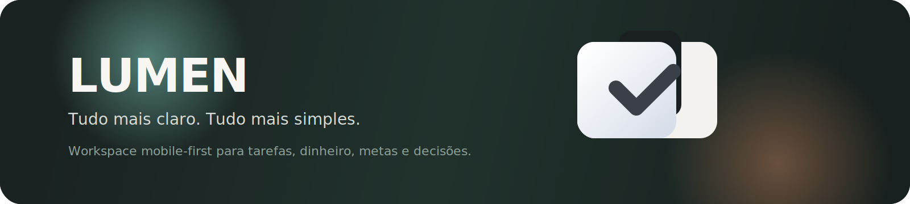

<p align="center">
  
</p>

<h1 align="center">✨ LUMEN</h1>

<p align="center">
  
  
  
  
  
</p>

# Tudo mais claro. Tudo mais simples.
O LUMEN é um SaaS de organização de vida criado pela `codeStage Solucoes` para conectar tarefas, dinheiro, metas, tempo e decisões em uma única experiência. A versão 1.1.0 consolida a base mobile-first do produto com shell responsivo, identidade visual própria, personalização de tema e assistente mais orientado a perguntas reais sobre rotina e finanças.

## ✨ Visão rápida

- 🎯 **Objetivo:** transformar panorama pessoal em próximos passos claros.
- 📱 **Experiência mobile-first:** sidebar, bottom nav e telas desenhadas para uso diário no celular.
- 🎨 **Identidade visual própria:** novos temas, logo oficial e auth flow alinhado à marca.
- 🧠 **Assistente contextual:** respostas mais específicas para finanças, dívida, foco e vida pessoal.
- 🔐 **Base de privacidade:** consentimento de IA, exportação e exclusão de conta.

## 🧩 Funcionalidades resumidas

### 🆕 Destaques da versão 1.1.0
- **Workspace redesenhado** com shell autenticado, navegação lateral/mobile e superfícies unificadas.
- **Módulos refeitos** para Dashboard, Tarefas, Finanças, Metas, Importações, Notificações, Configurações, Suporte e Selah IA.
- **Auth e branding atualizados** com a logo oficial do LUMEN, slogan e PWA branding.
- **Sistema de temas expandido** com quatro atmosferas visuais: Atelier, Jardim, Brasa e Maré.
- **Assistente mais preciso** para leitura financeira, quitação de dívida, rotina e decisões práticas.

### 🧭 1) Núcleo do workspace
- Dashboard agregado com prioridades, metas, dinheiro, lembretes e notificações.
- Tarefas com categorias, impacto financeiro e foco operacional do dia.
- Metas com progresso, aportes e horizonte de conclusão.
- Finanças com saldo, risco, previsão e histórico recente.

### 📥 2) Importação e operação
- Preview e commit de transações por CSV.
- Notificações locais e feed interno de alertas.
- Suporte integrado ao workspace.

### 🧠 3) Selah IA e leitura contextual
- Perguntas guiadas por foco, finanças e organização pessoal.
- Respostas com highlights, próximos passos e confiança declarada.
- Fallback local para cenários offline.

### ⚙️ 4) Conta, privacidade e preferências
- Cadastro com consentimento de privacidade e IA.
- Exportação e exclusão da conta.
- Preferências financeiras, visuais e operacionais.

## 🧱 Stack

- Backend: NestJS 10, Prisma ORM, PostgreSQL, Redis, JWT, Swagger
- Frontend: Angular 16 standalone, TypeScript, SCSS, PWA
- Infra: Docker Compose, Redis/BullMQ, seeds realistas, Capacitor para iOS

## 🚀 Como executar

### 1. Instalar dependências

```bash
npm install
npm --prefix backend install
npm --prefix frontend install
```

### 2. Desenvolvimento completo

```bash
cp .env.example .env
cp backend/.env.example backend/.env
npm run dev
```

### 3. Subir backend e frontend separadamente

```bash
npm run dev:infra
npm run dev:backend
npm run dev:frontend
```

### 4. Build de produção

```bash
npm run build
```

## 📱 Mobile e offline

- O frontend opera em base **offline-first** para dashboard, tarefas, metas, finanças e assistente local.
- O fluxo mobile usa Capacitor para build/sync do iOS.
- O shell mobile mantém sidebar e navegação inferior integradas na mesma linguagem visual.

Atalhos principais:

```bash
npm run mobile:build
npm run mobile:sync
npm run mobile:add:ios
npm run mobile:open:ios
```

## ⚙️ Configuração rápida

- Frontend: `src/assets/app-config.js` é gerado via `frontend/scripts/generate-runtime-config.mjs`.
- Backend: configure `DATABASE_URL` ou `POSTGRES_*`, `JWT_SECRET` e, se necessário, variáveis de Redis.
- Selah IA: configure a URL/base key do serviço para respostas externas.

## ✅ Verificação rápida

```bash
npm run build
npm --prefix backend test -- --runInBand
npm --prefix frontend run build
```

## 🔐 Credenciais demo

- Usuário: `demo@lumen.local`
- Senha: `Demo123!`

## 📌 Documentação complementar

- 🧱 Arquitetura: `docs/architecture.md`
- 🎨 Design system: `docs/design-system.md`
- 📝 Release notes 1.1.0: `docs/releases/v1.1.0.md`
